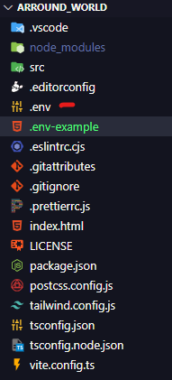

# React_Native_Arround_the_World


 Projeto de exibição de caracteristicas de Pais

<a href="https://github.com/carlosbandelli">

</a>

<a href="#">

</a>

<a href="#">

</a>

<a href="https://github.com/carlosbandelli/Cards/commits/main">

</a>
<hr/>


## 💡 Sobre o projeto:

O projeto visa desenvolver uma aplicação web utilizando as tecnologias Vite.js, React.js, Axios, Typescript e Tailwind. O objetivo é criar uma plataforma para consulta de informações de países, integrando a API RestCountries <a href="https://restcountries.com/">https://restcountries.com/</a>, proporcionando uma experiência de usuário clara e diferenciada.

##🔥 Quais são as funcionalidades?

As funcionalidades exigidas incluem a busca por nome de país com opção de exibição em formato de tabela ou em um formato diferente definido pelo desenvolvedor, além de apresentar informações como nome, capital, população, moeda e idioma. Requisitos opcionais envolvem a representação gráfica do país .<br/>


## ⚙️ Techs:
### 📺 FRONT-END

-  React Native
-  Typescript
- Expo Go


<hr/>

## ⛏ Ferramentas:

- [Visual Studo Code](https://code.visualstudio.com/download)

## 🏁 Configuração ambiente:

Para executar a aplicação:
Precisa fazer o git clone do projeto<br/>
Fique á vontade para clonar de quaisquer uma das seguintes chaves na sua maquina<br/>

#### Chave SSH:
```
 git clone git@github.com:carlosbandelli/Arround_world.git
```

#### Chave HTTPS:
```
git clone https://github.com/carlosbandelli/Arround_world.git

```
### 📺 FRONT-END:

Abra um terminal direto da pasta raiz a pasta SRC e execute o comando no terminal

```
npm install
```

# Importante, para se fazer requisição crie um arquivo <strong>.env</strong> na raiz do projeto igual imagem abaixo:



Para facilitar a criação do arquivo <strong>.env</strong>, existem um arquivo chamado <strong>.env-example</strong>, renomei o arquivo para <strong>.env</strong> e apague o que tem no arquivo e coloque o código abaixo:

```
REACT_APP_BASE_URL=https://restcountries.com/v3.1/

```

 Nesta parte apos instalar as dependencia, abra um terminal direta da pasta SRC e utilize o comando:
 
 ```
 npx expo start
 
 ``` 
Pronto projeto rodando!
